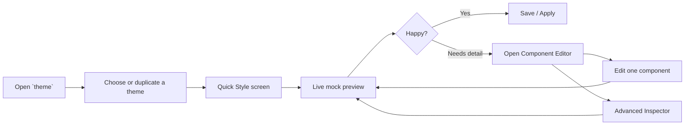
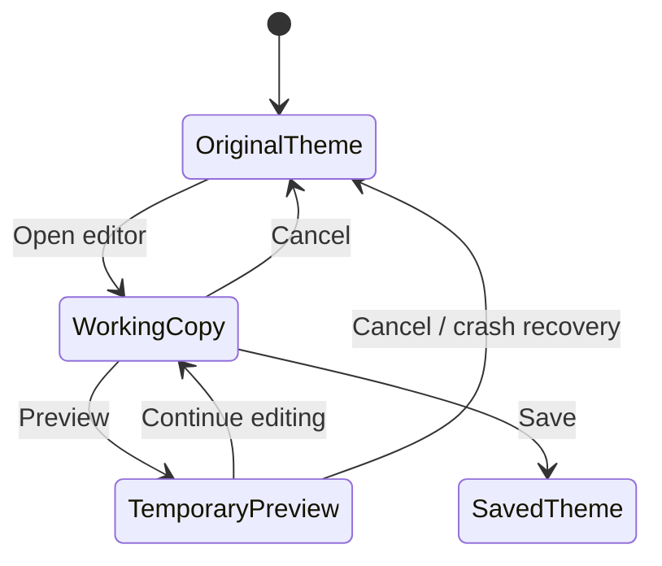

# ✨ Theme Studio TUI

> [!abstract] Vision
> Turn the existing `theme` command into a beautiful, fast, keyboard-first desktop theme studio that feels welcoming to beginners while still giving advanced users deep control.

The goal is **not** to expose every setting at once.

The goal is to make the most common tasks feel effortless:

1. Pick a look.
2. Adjust the vibe.
3. Preview it live.
4. Save it safely.
5. Go deeper only when needed.

---

## 🧩 Current Foundation

The repository already has the right bones for this product:

- `theme` opens an interactive TUI when run without arguments.
- The existing picker switches theme, shape, texture, and animation.
- Theme JSON files act as the source of truth.
- The generator already understands window gaps, border width, rounding, opacity, dimming, blur, shadows, animations, and semantic palette roles.
- Waybar is already a theme target and reloads with the rest of the desktop.
- Other supported targets already include Kitty, Starship, Neovim, Wofi, Rofi, Dunst, Hyprlock, GTK, Qt, Firefox, KDE, XFCE, Alacritty, VS Code, the homepage overlay, and wallpaper handling.

The redesign therefore does **not** need to replace the working theme engine. It should place a safer, more intuitive editor on top of it and gradually move complex generators into focused modules.

---

## 🌟 Product Principle

> [!important] Easy on the surface, powerful underneath
> The app should begin with a small number of human-friendly choices, then reveal detailed controls only when the user asks for them.

Instead of presenting forty sliders immediately, the editor should guide users through **three layers**:

| Layer | Intended user | What it shows |
|---|---|---|
| **Quick Style** | Everyone | Theme, spacing, shape, blur, border mood, Waybar style |
| **Component Editor** | Curious users | Windows, Waybar, launcher, notifications, terminal, lock screen |
| **Advanced Inspector** | Power users | Exact role mapping, raw values, per-state styling, application-specific overrides |

This creates a simple workflow without sacrificing any of the customization power.

---

# 🧭 The Main Workflow



## The core experience

When the user runs:

```bash
theme
```

They should land on a calm home screen with only a few clear actions:

- **Use a theme**
- **Customize current theme**
- **Create from wallpaper**
- **Manage themes**

No giant settings wall. No confusing schema language. No raw JSON unless explicitly requested.

---

# 🏠 Screen 1 — Home

```text
┌──────────────────────────────────────────────────────────────────────┐
│  ✦ THEME STUDIO                                      Current: Sakura │
├──────────────────────────────────────────────────────────────────────┤
│                                                                      │
│   Make your desktop feel like yours.                                 │
│                                                                      │
│   ┌─────────────────────────┐  ┌─────────────────────────┐           │
│   │  1  Customize Current   │  │  2  Browse Themes      │           │
│   │     Adjust the vibe     │  │     Preview presets    │           │
│   └─────────────────────────┘  └─────────────────────────┘           │
│                                                                      │
│   ┌─────────────────────────┐  ┌─────────────────────────┐           │
│   │  3  From Wallpaper      │  │  4  Manage Themes      │           │
│   │     Build a palette     │  │     Rename / duplicate │           │
│   └─────────────────────────┘  └─────────────────────────┘           │
│                                                                      │
├──────────────────────────────────────────────────────────────────────┤
│  ↑↓ Move   Enter Open   / Search   ? Help   q Quit                   │
└──────────────────────────────────────────────────────────────────────┘
```

### Why this works

- It avoids dumping users directly into technical controls.
- It frames the app around outcomes instead of settings.
- It creates a clear mental model before deeper editing begins.

---

# 🎛️ Screen 2 — Quick Style

This should be the main editing screen for most people.

The controls use friendly names rather than raw config keys.

```text
┌────────────────────────────────────────────────────────────────────────────┐
│  ← Home     SAKURA / QUICK STYLE                         ● Live Preview ON │
├──────────────────────┬──────────────────────────────┬──────────────────────┤
│  LOOK                │  ADJUST                      │  PREVIEW             │
│                      │                              │                      │
│  Palette             │  Spacing                    │  ┌───────────────┐   │
│  ● Sakura            │  Cozy  ━━━━━●━━━━  Airy     │  │ 󰍜  Terminal ×│   │
│                      │                              │  ├───────────────┤   │
│  Shape               │  Corners                    │  │               │   │
│  ○ Sharp             │  Square ━━━━━●━━ Rounded    │  │  hello there  │   │
│  ● Soft              │                              │  │               │   │
│  ○ Pillowy           │  Blur                       │  └───────────────┘   │
│                      │  Off ━━━━━━━●━━ Strong       │                      │
│  Texture             │                              │  ┌────────────────┐ │
│  ● Frosted           │  Border Style               │  │ 1  2  3   12:42│ │
│  ○ Clear             │  Minimal / Defined / Glow   │  └────────────────┘ │
│  ○ Haze              │                              │                      │
│                      │  Waybar Style                │  [Window] [Waybar]  │
│  Animation           │  Full / Floating / Islands  │  [Menu]   [Notify]  │
│  ● Smooth            │                              │                      │
├──────────────────────┴──────────────────────────────┴──────────────────────┤
│  S Save As   Enter Apply   Tab Details   U Undo   R Reset   Esc Cancel     │
└────────────────────────────────────────────────────────────────────────────┘
```

## Quick Style controls

Only expose the settings people understand instantly:

| Friendly control | What it controls underneath |
|---|---|
| **Spacing** | Inner gaps, outer gaps, common component padding |
| **Corners** | Window, Waybar, launcher, and notification radius |
| **Blur** | Blur enabled, size, passes, brightness, contrast |
| **Border Style** | Width, active emphasis, inactive subtlety, glow preset |
| **Glassiness** | Opacity, background alpha, blur combination |
| **Waybar Style** | Full bar, floating bar, islands, minimal |
| **Animation** | Existing animation preset |
| **Density** | Compact, comfortable, spacious component spacing |

Each high-level control should modify several related values through a preset curve.

Example:

```yaml
spacing: cozy
# resolves to
window_gaps_in: 5
window_gaps_out: 10
waybar_module_padding: 8
launcher_padding: 10
notification_padding: 12
```

The user can later override any of those values individually in the Component Editor.

---

# 🪄 Progressive Disclosure

The editor should never display advanced fields until they are useful.

### Default view

```text
Border Style:  Minimal  [ Defined ]  Glow
```

### After pressing `Tab` or choosing “Fine Tune”

```text
Border Style: Defined

Active border      [ focus         ▼ ]
Inactive border    [ border_subtle ▼ ]
Border width       ━━━●━━━━━━━━━━  2
Gradient           [ On ]
Gradient color 2   [ accent2      ▼ ]
Gradient angle     ━━━━━━━●━━━━━━ 45°
Glow               ━●━━━━━━━━━━━━  8%
```

This keeps the beginner experience clean while allowing expert control inside the same screen.

---

# 🧩 Screen 3 — Component Editor

The Component Editor should feel like choosing a room in a house, not navigating a config file.

```text
┌──────────────────────────────────────────────────────────────────────────┐
│  SAKURA / COMPONENTS                                    Changes: 4 unsaved│
├───────────────────┬──────────────────────────────────────────────────────┤
│  COMPONENTS       │                                                      │
│                   │  Choose what you want to customize                   │
│  › Windows        │                                                      │
│    Waybar         │  ┌──────────┐  ┌──────────┐  ┌──────────┐           │
│    Launcher       │  │ Windows  │  │ Waybar   │  │ Launcher │           │
│    Notifications  │  │ borders  │  │ modules  │  │ search   │           │
│    Terminal       │  └──────────┘  └──────────┘  └──────────┘           │
│    Prompt         │                                                      │
│    Lock Screen    │  ┌──────────┐  ┌──────────┐  ┌──────────┐           │
│    Homepage       │  │ Notify   │  │ Terminal │  │ Lock     │           │
│    Apps           │  │ urgency  │  │ tabs     │  │ layout   │           │
│                   │  └──────────┘  └──────────┘  └──────────┘           │
│                   │                                                      │
├───────────────────┴──────────────────────────────────────────────────────┤
│  Enter Edit   Space Preview   / Search Setting   Esc Back                │
└──────────────────────────────────────────────────────────────────────────┘
```

Each component page should show only the settings relevant to that component.

---

# 🪟 Windows Editor

```text
┌──────────────────────────────────────────────────────────────────────────┐
│  COMPONENTS / WINDOWS                                      Preview: Live │
├──────────────────────┬────────────────────────────┬──────────────────────┤
│  PRESET              │  FINE TUNE                │  WINDOW PREVIEW      │
│                      │                            │                      │
│  Style               │  Outer gaps       10      │  ┌───────────────┐   │
│  ● Soft Glass        │  Inner gaps        5      │  │ active window │   │
│  ○ Clean Flat        │  Border width      2      │  ├───────────────┤   │
│  ○ Neon Edge         │  Corner radius    12      │  │               │   │
│  ○ Retro Box         │  Active opacity 1.00      │  │               │   │
│                      │  Inactive       0.92      │  └───────────────┘   │
│  Border              │  Inactive dim   0.08      │                      │
│  [ Gradient Focus ]  │                            │  ┌───────────────┐   │
│                      │  Blur size        8        │  │ inactive      │   │
│  Shadow              │  Blur passes      3        │  └───────────────┘   │
│  [ Soft ]            │  Shadow radius   20        │                      │
│                      │                            │                      │
├──────────────────────┴────────────────────────────┴──────────────────────┤
│  P Presets   Tab Advanced   U Undo   Enter Apply   Esc Back              │
└──────────────────────────────────────────────────────────────────────────┘
```

## Window presets

- Clean Flat
- Soft Glass
- Frosted
- Sharp Technical
- Retro Box
- Neon Edge
- Borderless
- Minimal Dark

Presets set sensible bundles, then individual controls remain editable.

---

# 📊 Waybar Editor

Waybar should remain inside the same Theme Studio because users experience it as part of the overall desktop theme.

Its code can live in a separate module, but its interface should feel integrated.

```text
┌────────────────────────────────────────────────────────────────────────────┐
│  COMPONENTS / WAYBAR                                      Layout: Islands │
├──────────────────────┬──────────────────────────────┬──────────────────────┤
│  APPEARANCE          │  MODULES                     │  LIVE PREVIEW        │
│                      │                              │                      │
│  Layout              │  LEFT                        │  ╭────╮ ╭────╮       │
│  ○ Full              │  ≡ Workspaces                │  │1 2 3│ │Apps│       │
│  ○ Floating          │  ≡ Launcher                  │  ╰────╯ ╰────╯       │
│  ● Islands           │                              │                      │
│  ○ Minimal           │  CENTER                      │      ╭────────╮      │
│                      │  ≡ Window title              │      │ themes │      │
│  Height         34   │                              │      ╰────────╯      │
│  Outer margin   10   │  RIGHT                       │                      │
│  Module gap      8   │  ≡ Network                   │  ╭───────────────╮   │
│  Module padding 10   │  ≡ Audio                     │  │   󰕾  12:42  │   │
│  Radius         14   │  ≡ Battery                   │  ╰───────────────╯   │
│  Opacity       .88   │  ≡ Clock                     │                      │
│                      │                              │                      │
├──────────────────────┴──────────────────────────────┴──────────────────────┤
│  J/K Move module   H/L Change group   Space Toggle   Tab Style   Enter Apply│
└────────────────────────────────────────────────────────────────────────────┘
```

## Waybar customization

### Appearance

- Position: top or bottom
- Full width or floating width
- Height
- Outer margins
- Module spacing
- Module padding
- Font size
- Icon size
- Corner radius
- Border width and color role
- Background role and opacity
- Blur and shadow
- Single surface or island groups

### Module layout

- Enable or disable modules
- Reorder modules
- Move modules between left, center, and right
- Choose compact or verbose formats
- Set clock format
- Configure battery warning thresholds
- Configure workspace presentation
- Customize active, inactive, empty, and urgent workspace states

### Per-module style

The default remains inherited from the Waybar style.

Only show per-module overrides after the user chooses:

```text
Customize this module separately?  [ No ] [ Yes ]
```

This prevents the interface from becoming overwhelming.

---

# 🎨 Palette Studio

The palette editor should focus on **roles**, not application-specific colors.

```text
┌──────────────────────────────────────────────────────────────────────────┐
│  PALETTE STUDIO / SAKURA                           Contrast health: GOOD │
├─────────────────────────┬──────────────────────────────┬─────────────────┤
│  CORE COLORS            │  SEMANTIC ROLES              │  SAMPLE         │
│                         │                              │                 │
│  Background   #17131A   │  Window background   bg      │  Normal text    │
│  Surface      #221C27   │  Raised surface       bg_alt │  Selected text  │
│  Text         #F5EAF1   │  Main text            text   │  Error message  │
│  Muted        #A993A3   │  Muted text           dim    │                 │
│  Accent       #FF5AA5   │  Focus border         focus  │  ███████████    │
│  Accent 2     #B98CFF   │  Selection            accent │  ███████████    │
│  Urgent       #FF647C   │  Warning              warning│                 │
│                         │  Success              success │                 │
│  [+ Add Color]          │                              │                 │
├─────────────────────────┴──────────────────────────────┴─────────────────┤
│  E Edit color   X Swap   L Lock   G Generate variants   C Check contrast │
└──────────────────────────────────────────────────────────────────────────┘
```

## Palette guardrails

- Show contrast warnings without blocking creativity.
- Suggest a safer text color when contrast is poor.
- Allow colors to be locked before regenerating variants.
- Support hex, RGB, and HSL entry.
- Allow global role swapping.
- Keep application overrides hidden by default.

> [!tip] Friendly wording
> Use labels such as **Main background**, **Raised surface**, **Focus color**, and **Muted text**. Show raw role names in smaller text for advanced users.

---

# 🧠 Smart Presets, Not Rigid Presets

A preset should be a starting point, never a cage.

A theme is built from independent axes:

| Axis | Examples |
|---|---|
| Palette | Sakura, Carbon, Ocean, custom wallpaper palette |
| Shape | Sharp, soft, rounded, pillowy, retro box |
| Texture | Clear, frosted, haze, glaze, bloom |
| Spacing | Compact, cozy, airy |
| Borders | Minimal, defined, gradient, glow |
| Waybar | Full, floating, islands, minimal |
| Animation | None, subtle, smooth, snappy, bouncy |

The user can mix them freely:

```text
Palette:     Sakura
Shape:       Sharp
Texture:     Frosted
Spacing:     Compact
Borders:     Gradient
Waybar:      Islands
Animation:   Snappy
```

---

# 🔍 Search Instead of Hunting

Pressing `/` anywhere opens a command palette.

```text
┌──────────────────────────────────────────────────────────────┐
│  Search settings…                                           │
│  > inactive border                                          │
├──────────────────────────────────────────────────────────────┤
│  Windows › Borders › Inactive border color                  │
│  Windows › Borders › Inactive border opacity                │
│  Waybar › Workspaces › Inactive workspace border            │
│  Kitty › Tabs › Inactive tab border                         │
└──────────────────────────────────────────────────────────────┘
```

This makes a large feature set manageable without adding visible clutter.

---

# 👁️ Preview System

The preview system should have two levels.

## 1. Instant mock preview

Rendered directly inside the TUI.

Advantages:

- Immediate response
- No desktop flicker
- No repeated process reloads
- Safe while exploring
- Can preview components that are not currently running

## 2. Real desktop preview

A toggle applies temporary changes to the running desktop.

```text
Live Desktop Preview: OFF

[Space] Enable temporary live preview
```

When enabled:

- Changes apply after a short debounce.
- The original theme remains stored in memory.
- Cancel restores the original state.
- Save writes the theme permanently.

> [!warning] Never write every arrow-key movement permanently
> Work from an in-memory draft. Save only when the user confirms.

---

# 🛡️ Safe Editing Model

## Editing lifecycle



## Required safety features

- Working copy held in memory
- Undo and redo stack
- Original-state snapshot
- Automatic crash-recovery draft
- “Save as new theme” by default when editing built-in themes
- Validation before save
- Atomic file replacement
- Backup before migration
- Revert temporary preview on cancel

---

# 💾 Save Flow

The save screen should be simple and reassuring.

```text
┌──────────────────────────────────────────────────────────────┐
│  SAVE THEME                                                  │
├──────────────────────────────────────────────────────────────┤
│                                                              │
│  Theme name                                                  │
│  [ Sakura Frosted________________________________________ ]  │
│                                                              │
│  Save mode                                                   │
│  ● Create a new theme                                        │
│  ○ Replace Sakura                                            │
│                                                              │
│  Include                                                     │
│  ☑ Palette       ☑ Window style      ☑ Waybar layout         │
│  ☑ App styling   ☑ Wallpaper         ☑ Animation             │
│                                                              │
│  Theme validation: ✓ No errors   ⚠ 1 contrast suggestion    │
│                                                              │
│                 [ Cancel ]   [ Save & Apply ]                 │
└──────────────────────────────────────────────────────────────┘
```

---

# 🧰 Advanced Inspector

This page exists for power users but should never be the default.

```text
┌──────────────────────────────────────────────────────────────────────────┐
│  ADVANCED INSPECTOR / WINDOWS › ACTIVE BORDER                           │
├──────────────────────────┬───────────────────────────────────────────────┤
│  PROPERTY                │  VALUE                                        │
│                          │                                               │
│  Color role              │  focus                                        │
│  Secondary role          │  accent2                                      │
│  Gradient angle          │  45                                           │
│  Opacity                 │  1.0                                          │
│  Width                   │  2                                            │
│  Glow radius             │  0                                            │
│  State                   │  active                                       │
│                          │                                               │
│  Generated output        │  col.active_border = rgba(...) rgba(...) 45deg│
│                          │                                               │
├──────────────────────────┴───────────────────────────────────────────────┤
│  V View source   D Restore inherited value   Enter Apply                 │
└──────────────────────────────────────────────────────────────────────────┘
```

Advanced abilities can include:

- Exact numeric entry
- Per-component state overrides
- Raw generated output preview
- Inheritance visualization
- Restore inherited value
- Custom palette-role assignment
- Unsupported-value warnings
- Export or edit JSON

---

# 🧱 Information Architecture

```text
Theme Studio
├── Home
├── Quick Style
│   ├── Palette
│   ├── Shape
│   ├── Texture
│   ├── Spacing
│   ├── Borders
│   ├── Waybar style
│   └── Animation
├── Components
│   ├── Windows
│   ├── Waybar
│   ├── Launcher
│   ├── Notifications
│   ├── Terminal
│   ├── Prompt
│   ├── Lock Screen
│   ├── Homepage
│   └── Apps
├── Palette Studio
├── Wallpaper Studio
├── Advanced Inspector
├── Theme Manager
└── Save / Export
```

---

# ⌨️ Keyboard Design

Use the same keys everywhere whenever possible.

| Key | Action |
|---|---|
| `↑ ↓ ← →` | Navigate or adjust |
| `Enter` | Open or confirm |
| `Space` | Toggle or preview |
| `Tab` | Switch simple/detail view |
| `/` | Search settings |
| `u` | Undo |
| `Ctrl+r` | Redo |
| `s` | Save |
| `p` | Presets |
| `r` | Reset current control or section |
| `?` | Contextual help |
| `Esc` | Back or cancel |
| `q` | Quit from top-level screens |

The footer should always display the keys relevant to the current screen.

---

# 🎭 Visual Style of the TUI

The app itself should feel themed by the active theme.

## Recommended look

- Rounded box-drawing characters where supported
- Active theme colors used for focus and selection
- Soft hierarchy rather than bright rainbow colors everywhere
- Icons used sparingly
- Large whitespace and consistent padding
- A clear three-column layout on wide terminals
- Responsive two-column layout on medium terminals
- Single-column wizard fallback on narrow terminals

## Responsive behavior

### Wide terminal

```text
Navigation | Controls | Preview
```

### Medium terminal

```text
Controls | Preview
```

### Narrow terminal

```text
One page at a time
[Preview] opens as a temporary full-screen panel
```

---

# 🏗️ Recommended Code Architecture

The current `bin/theme` script should remain the command entry point, but the editor should be split into focused modules.

```text
bin/
├── theme                     # CLI entry point and command routing
├── theme_tui.py              # Application shell and navigation
├── theme_tui_widgets.py      # Sliders, role pickers, cards, help popovers
├── theme_preview.py          # Mock previews and preview state
├── theme_schema.py           # Defaults, ranges, labels, validation
├── theme_editor.py           # Working copy, undo/redo, save lifecycle
├── theme_waybar.py           # Waybar layout and style generation
├── theme_components.py       # Component registration
├── theme_effects.py          # Existing shape/texture/animation behavior
├── theme_homepage.py         # Existing homepage behavior
└── theme_starship.py         # Existing Starship renderer
```

## Why split it this way

- `theme` stays readable.
- Waybar complexity does not bloat the main command.
- The TUI can iterate without risking generator logic.
- Components can register their own controls and preview renderer.
- Future targets can be added without redesigning the entire app.

---

# 🧬 Theme Data Model

The theme file should support three levels:

```yaml
roles:
  bg: "#17131A"
  bg_alt: "#221C27"
  text: "#F5EAF1"
  text_dim: "#A993A3"
  accent: "#FF5AA5"
  accent2: "#B98CFF"
  urgent: "#FF647C"
  focus: "#FF5AA5"
  border_normal: "#4A3948"

style:
  spacing_preset: cozy
  shape_preset: soft
  texture_preset: frosted
  border_preset: gradient
  animation_preset: smooth

components:
  windows:
    gaps_out: 10
    gaps_in: 5
    border_width: 2
    active_border:
      color: focus
      color_2: accent2
      angle: 45
    inactive_border:
      color: border_normal
      opacity: 0.66

  waybar:
    layout: islands
    position: top
    height: 34
    margin: 10
    module_gap: 8
    module_padding: 10
    radius: 14
    background: surface_0
    opacity: 0.88
    modules:
      left: [workspaces, launcher]
      center: [window]
      right: [network, pulseaudio, battery, clock]
```

## Inheritance rule

A component value should be optional.

If missing, it inherits from the high-level style preset.

```text
Preset default → Component override → Per-state override
```

This keeps theme files compact while preserving deep customization.

---

# ✅ Validation Design

Validation should feel helpful rather than punitive.

```text
✓ Theme JSON is valid
✓ All required palette roles are present
✓ Waybar modules are recognized
⚠ Muted text contrast is low on raised surfaces
⚠ Blur passes above 5 may reduce performance
○ Firefox target is enabled but pywalfox was not detected
```

## Validation categories

- Schema validity
- Numeric range checks
- Color-format checks
- Contrast checks
- Unsupported Hyprland properties
- Missing applications
- Unknown Waybar modules
- Invalid font names
- Missing wallpaper files
- Conflicting overrides

---

# 🚀 Implementation Roadmap

## Phase 1 — Foundation

> [!success] Goal
> Replace the current picker with a safe editor shell while preserving all existing commands.

- Extract current TUI into `theme_tui.py`
- Add screen routing
- Add working-copy state
- Add original snapshot
- Add save, cancel, undo, and redo
- Add mock preview framework
- Preserve existing theme, shape, texture, and animation selection

## Phase 2 — Quick Style

- Add spacing control
- Add corner control
- Add blur control
- Add border-style control
- Add glassiness control
- Add Waybar-style selector
- Add density presets
- Add high-level preset resolver

## Phase 3 — Window Editor

- Expose inner and outer gaps
- Expose border width
- Add active and inactive border role selectors
- Add gradient angle
- Add opacity and dimming
- Add blur detail controls
- Add shadow detail controls
- Add window mock preview

## Phase 4 — Waybar Studio

- Move Waybar generation into `theme_waybar.py`
- Define Waybar component schema
- Add layout presets
- Add module enable/disable
- Add module ordering
- Add left/center/right movement
- Add workspace-state styling
- Add Waybar mock preview
- Add safe live reload

## Phase 5 — Palette Studio

- Add color editor
- Add role mapping
- Add contrast checking
- Add generated variants
- Add color locking
- Add palette import/export
- Add wallpaper palette extraction

## Phase 6 — Remaining Components

- Wofi and Rofi
- Dunst
- Kitty
- Starship
- Hyprlock
- Homepage
- GTK and Qt
- Neovim and VS Code

## Phase 7 — Polish

- Searchable setting palette
- Responsive terminal layouts
- Help overlays
- Theme comparison mode
- Crash recovery
- Migration tools
- Plugin-style component registration

---

# 🎯 Recommended MVP

The first release of the upgraded TUI should include only:

1. Home screen
2. Theme browser
3. Quick Style
4. Window editor
5. Waybar editor
6. Palette editor
7. Mock previews
8. Save as new theme
9. Undo, redo, cancel, and restore
10. Search settings

Everything else can be added behind the same architecture later.

This MVP would already feel like a complete product rather than an unfinished settings menu.

---

# 💎 Final Product Experience

A beginner should be able to do this:

```text
Run `theme`
→ Customize Current
→ Pick “Soft”, “Frosted”, “Islands”, and “Cozy”
→ See the preview
→ Save as “Sakura Frosted”
→ Done
```

A power user should be able to continue:

```text
Open Waybar
→ Move battery to center
→ Set workspace active border to accent2
→ Reduce module padding to 6
→ Set inactive window opacity to 0.88
→ Inspect generated config
→ Save
```

Both users should feel like the app was designed for them.

> [!quote] North star
> The editor should feel less like editing configuration files and more like styling a desktop in a creative studio.

---

# 📌 Build Recommendation

Use **one unified Theme Studio TUI** with separate internal modules for complex targets such as Waybar.

Do not create a separate Waybar app unless Waybar later becomes a standalone product with features unrelated to the active theme system.

The unified approach provides:

- One command
- One preview model
- One undo stack
- One theme file
- One save flow
- One consistent design language

That is the cleanest and most intuitive path forward.
